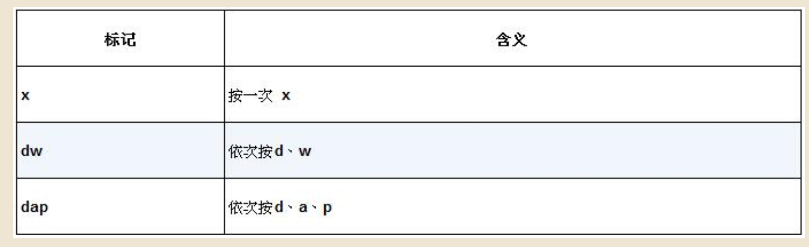
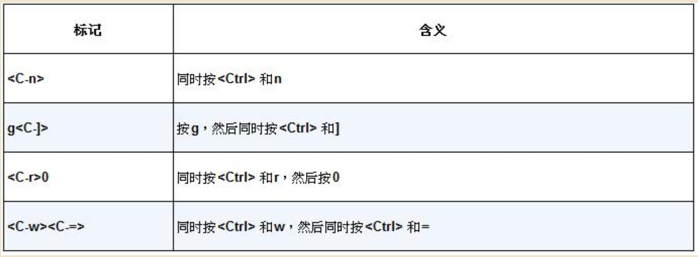
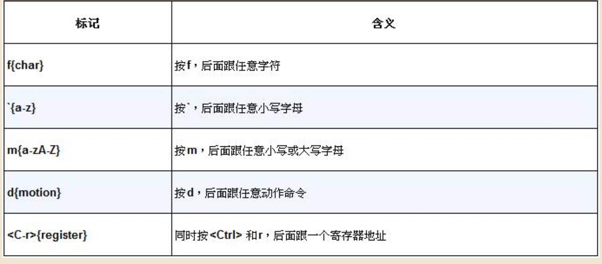
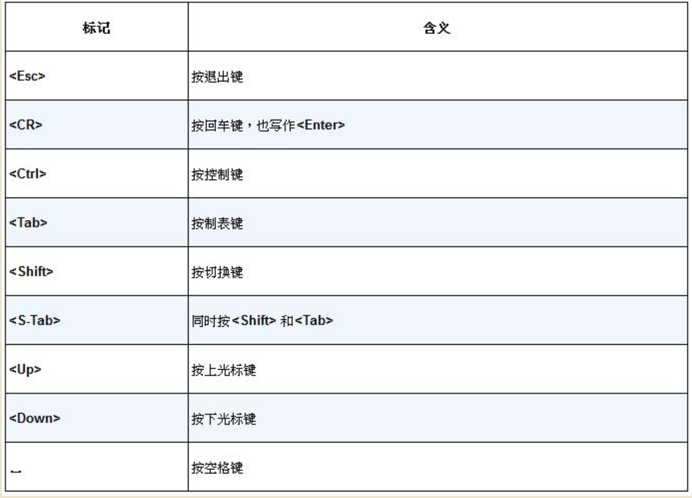
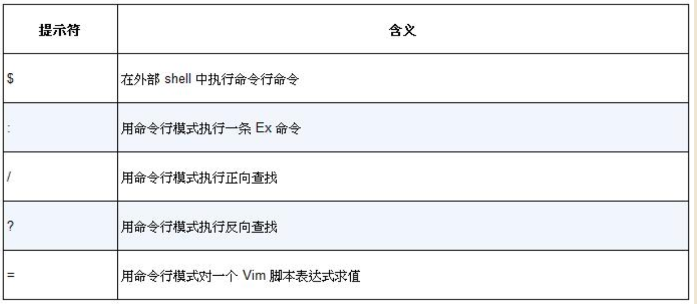
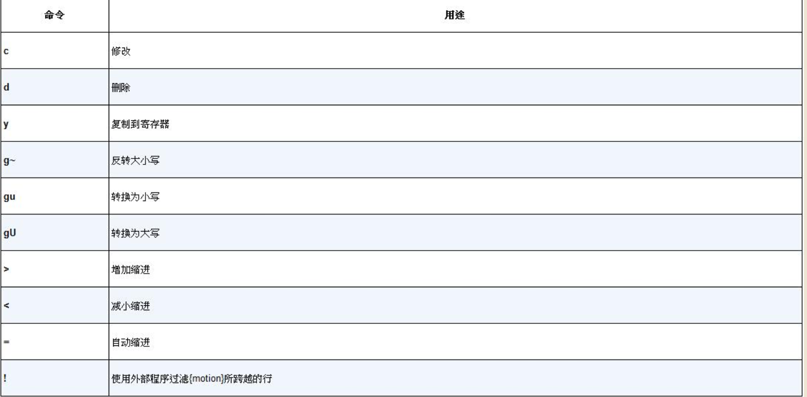

# 指令说明
#### 
#### 
#### 
#### 
#### 
# 启动
    vim -u NONE -N 不加载vimrc
    vim -u essentials.vim 加载指定脚本启动vim
    set nocompatible 设置vim用非兼容模式启动
    set hls 设置查找内容高亮
# 替换模式
    1. gR命令 进入替换模式，光标停留在原字符处
    2. gr命令 进入单次替换模式，光标停留在原字符处，
# 普通模式
### a命令 
    在当前字符后进入插入模式
### c命令
    ["x]c{motion} 由三部分组成：
        1. ["x] - 可选部分：指定使用的寄存器,使用默认寄存器,"x：指定寄存器 x（x 可以是 a-z、0-9、+、* 等）,作用：将删除的文本存入指定寄存器
        2. c - 命令：执行两个动作,删除指定范围的文本并进入插入模式
        3. {motion} - 移动动作：指定操作范围,如：w - 单词 $ - 行尾  t) - 直到右括号前
### G命令
    跳转到第[count]行，默认为最后一行定位到该行的第一个非空白字符（按行移动）。[count]G：跳转到指定行号
### A命令 
    在当前行未进入插入模式
### b命令 
    将光标移动到上一个单词开头
### w命令 
    将光标移动到下一个单词的开头，光标在单词的第一个字符
### e命令
    将光标移动到当前单词末尾，光标在单词的最后一个字符
### ge命令
    将光标移动到上一个单词的末尾，光标在单词的最后一个字符
### .命令 重复上一次修改
### >G命令 当前行到文件末尾所有行缩进,G表示文件末尾行，gg表示文件首行
### s命令 删除光标下的字符并进入插入模式
### f{char}命令 在当前行内，向前查找下一个指定的字符 {char}，如果找到了将光标移动到该字符上。
### F{char}命令 在当前行内，向后查找下一个指定的字符 {char}，如果找到了将光标移动到该字符上。
### t{char}命令 在当前行内，向前查找下一个指定的字符 {char}，如果找到了将光标移动到该字符之前。
### T{char}命令 在当前行内，向后查找下一个指定的字符 {char}，如果找到了将光标移动到该字符之前。
### ;命令 在当前行重复上一次f命令，继续向前查找下一个匹配的字符
### ,命令 在当前行反向重复上一次f命令，向后查找下一个匹配的字符
### u命令 撤销上次的修改
### /pattern 在文档中查找下一处匹配项
### ?pattern 在文档中查找上一处匹配项
### :s/target/replacement 
    执行替换,:%s/content/copy/g %表示整个文档，g表示每行的出现所有content全部替换
### *命令 查找当前光标所在的单词
### d	删除操作符	表示要执行删除操作
### a	文本对象选择器	表示选择"around"（包含周围的空白）
### w	单词文本对象	表示操作对象是单词
### dw命令 删除光标位置到单词结尾的内容，向后删除,可以使用[n]dw 表示重复执行n次dw操作，也可以使用d[n]w表示删除n个单词
### daw命令 删除光标所在单词和周围空格
### diw命令 删除光标所在单词
### cw命令 删除光标位置到单词结尾的内容，向后删除，并进入插入模式，这里的“单词”是指由字母、数字和下划线组成的序列，或者由非空白字符组成的序列，但会考虑标点符号等。具体来说，它根据iskeyword选项来界定单词。通常，一个单词由字母、数字和下划线组成，而标点符号和特殊字符被视为单独的词。和dw相同也可以使用[n]cw和c[n]w
### cW命令 删除光标位置到单词结尾的内容，向后删除，并进入插入模式，这个单词被定义为由非空白字符组成的序列，不考虑任何字符类型，只要不是空白（空格、制表符等）都算作一个WORD。也就是说，它会一直删除直到遇到空白为止，不管中间有什么标点符号。
### db命令 删除光标位置到单词开头的内容，向前删除
### cb命令 删除光标位置到单词开头的内容，向前删除，并进入插入模式
### o命令 在当前行下方插入一个空行，并进入插入模式
### O命令 在当前行上方方插入一个空行，并进入插入模式
### [count]ctrl—a和ctrl-x命令 分别对数字执行加和减操作，在不带次数执行时，他们会每次加减1，但是如果带一个[count]前缀，那么可以用他们加减任意整数，但是如果光标不在数字上，这两个命令都执行正向查找数字，把光标移到下一个数字之上后在执行对应的加减操作。
### ga命令 显示当前字符十进制、十六进制和八进制编码
## 操作符+动作命令=操作
### d{motion}命令 
    可以对一个字母（dl）、一个完整单词（daw）或一整个段落（dap），作用范围由motion决定，类似的c{motion} y{motion} 可以一个字母（yl）、可以是一个单词（yaw）、可以是一整个段落（yap）、从当前光标复制到指定字符（yf{char}）、从当前光标复制到指定字符之前（yt{char}）、，d、c、y被称作操作符（operator），可以用:h operator查看vim的完整文档
### 
### 动作命令
    l表示一个字母、aw表示一个单词、ap表示一个段落 ，例如gUl 当前字母转成大写、guap当前段落转成小写、gUaw当前单词转成大写。
### 额外规则
    一个操作符命令被连续执行两次时，它会作用于当前行。例如：dd（删除当前行），>>（缩进当前行,>G或者 >Enter 都是缩进所有行）,gU命令是一种特殊情况，gUU和gUgU效果相同都是当前行变为大写，同理gugu和guu效果相同将当前行转为小写

# 插入模式
### ctrl-h按键
    删除前一个字符同退格键
### ctrl-w按键
    删除前一个单词
### ctrl-u按键
    删除至行首
### esc或者ctrl-[按键
    切回普通模式
### ctrl-o按键：在插入模式下进入“插入-普通模式（可以使用普通模式下的命令，执行一个命令后恢复到插入模式）”，
### ctrl-r{register}按键
    将指定寄存器的内容粘贴到当前位置
### ctrl-r=5*8按键
    vim回将5*8的计算结果输出到光标所在为止
### ctrl-v{code}按键
    code是要插入字符的编码，且必须是三位数字，如果字母“A”则ctrl-v065，如果要输入的编码长度大于3为，比如unicode编码，则ctrl-vu{4位16进制编码}
# 可视模式
    v键是通往可是模式的达梦，在普通模式下，按v可激活面向字符的可是模式。
### 常用命令
    1. v命令 激活面向字符的可视模式 
    2. V命令 激活面向行的可视模式 
    3. ctrl-v命令 激活面向列的可是模式
    4. A命令 在选中列后进入插入模式
    5. I命令 在选中列前进入插入模式
    6. c命令 删除选中列进入插入模式
    7. gv命令 选取上一次选中的区域
    8. o命令 切换高亮选区的活动端，高亮选区的范围由两个端点界定。其中一段固定，另一端可以随光标移动，可以用o键来切换其活动的端点。在选定区域是，如果定义到一半，才发现选取开始的位置不对，此事用这个键会很方便，不用退出可视模式再从头开始，只需按一下o，然后重新调整选区的边界即可。
# 命令行模式
### 常用命令
#### :print
    在vim命令行显示光标所在行的内容，可以简写为:p
#### :数字
    1. vim会把数字解析为一个地址，并把光标移动到数字指定行的非空格首字母（行首如果是空格则跳过，到第一个非空格的字母上），可以使用$被当做是本文档的最后一行
    2. :3p 将光标跳转到第三行，并在命令行显示第三行内容
    3. :3d 将光标跳转到第三行，并删除光标所在行
    4. :{start},{end} 确定一个范围，%表示文档的所有行 .表示光标所在行 $表示文件最后一行。比如:1,3d删除第一行到第三行 、:1,3p 在命令显示第一行到第三行光标停留在第三行、:.,$d 删除当前行到文件最后一行、:%d 删除文档的全部行
       1. vim 也接受已正则表达式作为一条命令的地址，例如:/<html>/,/<\/html>/p 打印两个html标间（包含html标签行）的内容。
       2. 也可以正则和偏移量同时使用，例如:/<html>/+1,/<\/html>/-1p 打印两个html标间（不包含html标签行）的内容，偏移的一般新式如下:{start}+n,如果n被省略，那么缺省偏移量为1，{start}可以是一个行号、一个位置标记、或者一个查找模式
       3. {start}也可以是一个相对位置，例如.,.+3p 打印光标当前行到以后三行的内容
       4. :1 文件第一行
       5. :$ 文件最后一行
       6. :0 虚拟行位于文件第一行之上
       7. :. 光标所在行
       8. :% 整个文件
       9. :'< 高亮选择区第一行
       10. :'> 高亮选择区最后一行
    

